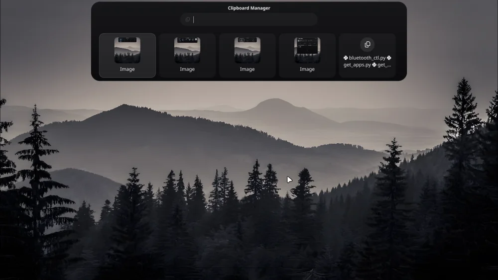
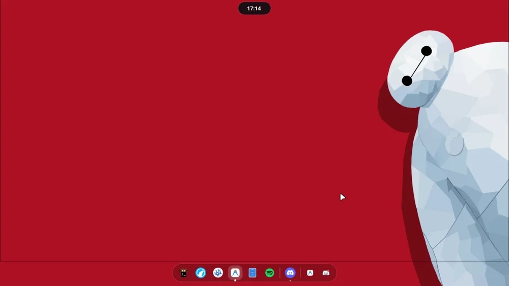
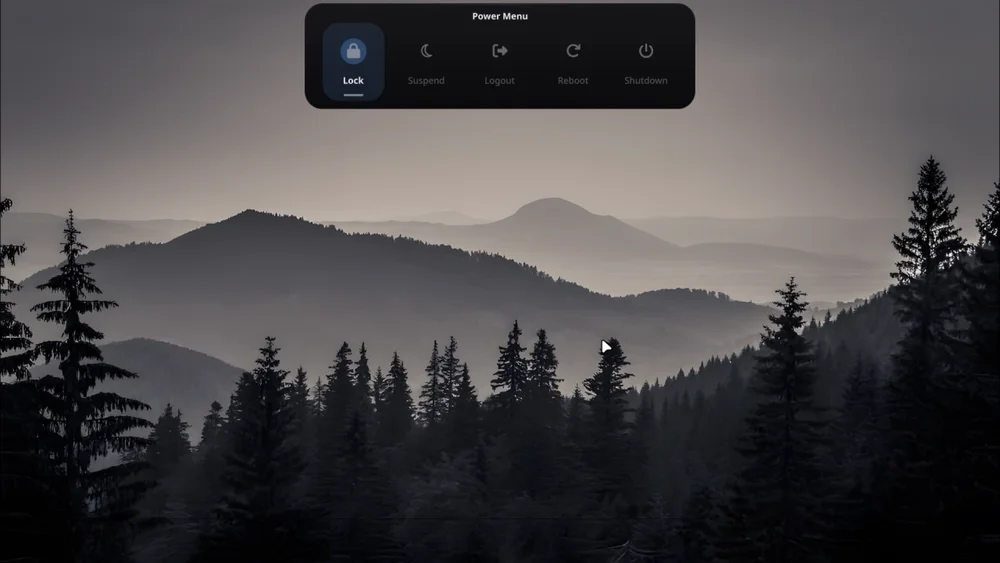
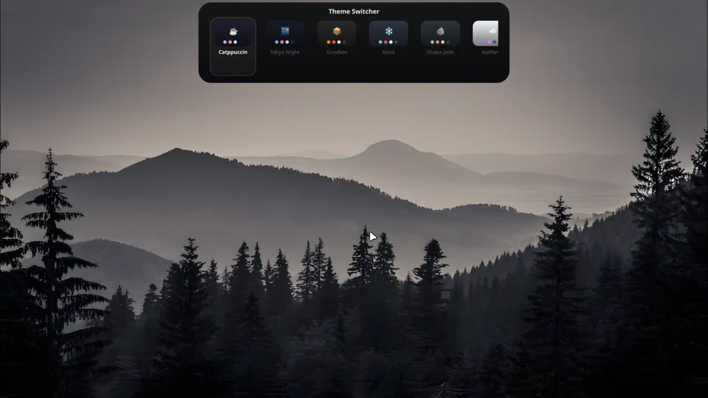
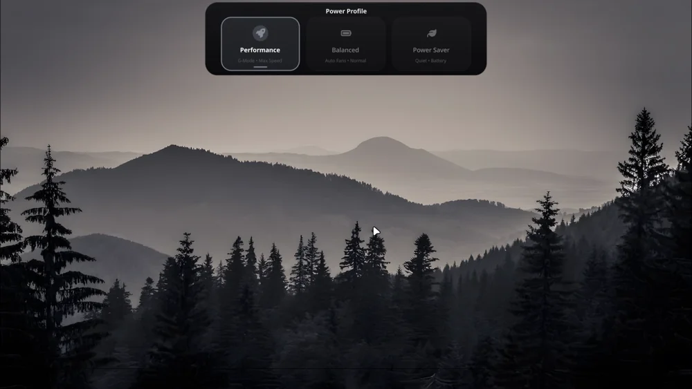
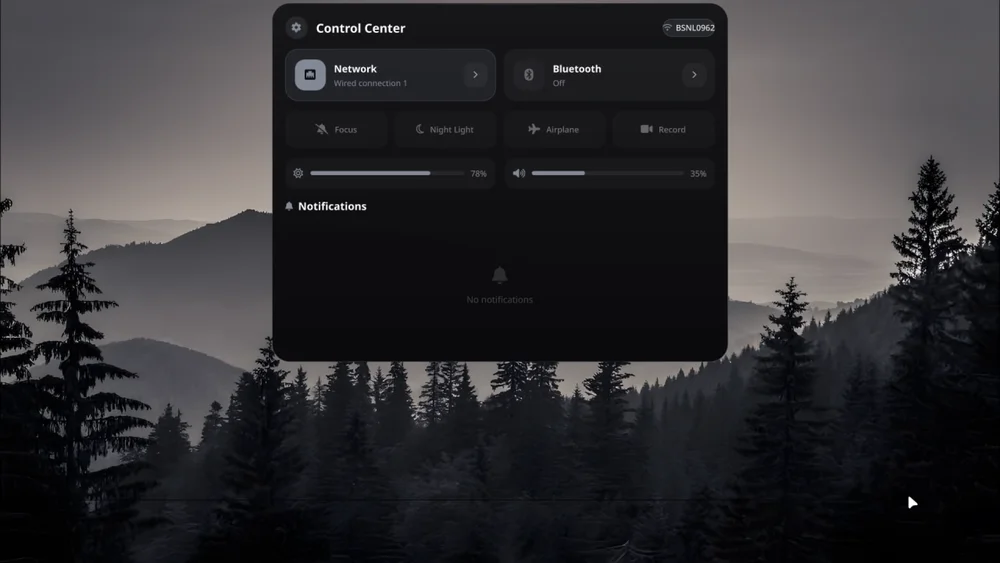
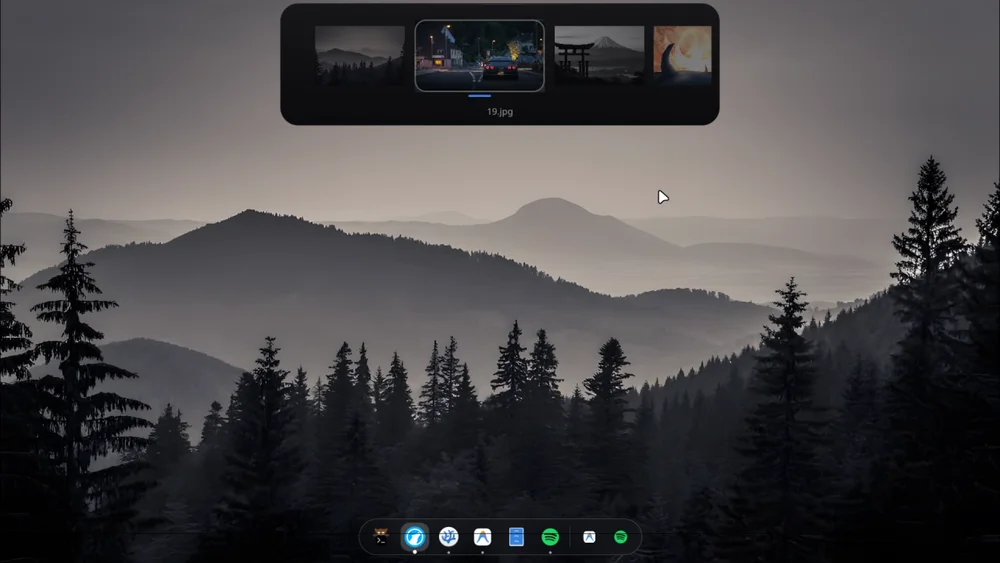

<div align="center">

# ZenShell 🏝️

**A Hyprland desktop where [ZenShell](zenshell/README.md) is the entire UI.**

[](https://github.com/zenXD45/zenshell/actions/workflows/lint.yml)


15 themes · 2 components · one installer

[Install](#installation) · [Keybinds](#keybinds) · [Structure](#structure)

</div>

---



One monorepo, two layers — and [ZenShell](zenshell/README.md) is the one you
actually see.

- **[ZenShell](zenshell/README.md)** — the glassmorphic suite on [Quickshell](https://quickshell.outfoxxed.me). Dynamic Island, dock, spotlight, control centre, theme and wallpaper pickers. It replaces **rofi, waybar, swaync *and* eww** in one process.
- **[HyprZen](hyprzen/README.md)** — the substrate underneath. Keybinds, window rules, animation, **15 generated themes** and a wallpaper-driven colour pipeline. Ships no bar, no launcher, no notification daemon.

The split is the whole point: HyprZen owns *behaviour and colour*, ZenShell owns *interface*. Neither can shadow the other, so there is nothing to disable or reconcile.

## Gallery

<p align="center">
  
  
</p>
<p align="center">
  
  
</p>
<p align="center">
  
  
</p>
<p align="center">
  
</p>

## Features

| | |
| :--- | :--- |
| **15 themes, one source of truth** | Colours live in `themes/source/*.toml`; `gen-themes.py` emits Lua, Hyprlang, CSS, Kitty and a JSON manifest. No hand-edited palette can drift. |
| **Dynamic colour** | `dynamic` and `matugen` themes derive the whole palette from your wallpaper via pywal / Matugen. |
| **Theme-aware geometry** | Gaps, borders, rounding, blur and shadow opacity are read from the theme, not hardcoded. |
| **No dead keybinds** | `scripts/check_keybinds.py` parses `keybinds.lua` and fails CI if a bound binary isn't installed by `install.sh`. |
| **Media keys built in** | Volume, mic, brightness and playback go straight to `wpctl` / `brightnessctl` — no OSD daemon required. |
| **Fonts handled** | GeistMono Nerd for the terminal, [Outfit](https://fonts.google.com/specimen/Outfit) for the UI. Installed and cached by the installer. |
| **Portable** | Every path resolves through `$HOME` / `Qt.homePath()`. Clone it anywhere; no edits needed. |

## Structure

```text
hyprzen/     Hyprland config & theming  → ~/.config/hypr, ~/scripts, ~/wallpapers
zenshell/    Quickshell UI suite        → ~/.config/quickshell/dynamic-island
docs/images/ screenshots used by this README
scripts/     repo-level tooling (CI checks)
```

## Installation

> Built for a from-scratch or existing **Arch Linux** install. Tested on Arch + `Hyprland` session; the installer is also safe to re-run and skips what is already in place.

```bash
git clone https://github.com/zenXD45/zenshell.git
cd zenshell
./install.sh
```

Then log into the `Hyprland` session (or `hyprctl reload`). ZenShell autostarts from `exec.lua` → `start_all.sh`; there is no manual `exec-once` line.

What `install.sh` does:

1. Installs official packages — Hyprland, kitty, pipewire, `firefox`, `thunar`, `vscodium`, the toolchain and more. **No waybar, no rofi, no swaync**; the island and dock are the UI.
2. Installs an AUR helper (`paru`, falling back to `yay`) and the AUR packages: `quickshell-git`, `matugen`, `hyprswitch`, `satty`, `hyprshot`, `waypaper`, `wlogout`, `pywal`, `adw-gtk3`, `bibata-cursor-theme`. **Failures warn, they don't abort.**
3. Downloads and caches **GeistMono Nerd Font** + **Outfit**.
4. Adds and enables the **scroll-overview** `hyprpm` plugin.
5. Detects NVIDIA and installs `nvidia-dkms` / `nvidia-utils`.
6. Configures **zsh**: Oh My Zsh + Powerlevel10k, plus `eza` / `bat` / `fzf` aliases, and offers `chsh`.
7. Runs `hyprzen/install.sh` to symlink configs into `~/.config`, link `~/scripts`, and copy wallpapers into `~/wallpapers`.
8. Installs ZenShell to `~/.config/quickshell/dynamic-island`, backing up anything already there.
9. Applies the default theme (`catppuccin`) and a matching wallpaper.
10. Enables NetworkManager, bluetooth and power-profiles-daemon.
11. **Verifies** the result — key binaries, configs, fonts and the ZenShell Python helpers — and warns about anything missing.

### Manual

If you'd rather run the pieces yourself, keep this order — ZenShell calls HyprZen's `theme-switch.sh`:

```bash
cd hyprzen  && ./setup.sh   # deps + symlinks
cd zenshell && ./install.sh # Quickshell suite
# then: hyprctl reload   (or SUPER+CTRL+R)
```

## ⌨️ Keybinds

Everything lives in `hyprzen/.config/hypr/modules/keybinds.lua`. ZenShell claims the plain `SUPER+` keys; HyprZen keeps terminal, app and system binds out of the way. Combos are unique — the CI checker enforces it.

### ZenShell
| Action | Shortcut |
| :--- | :--- |
| App launcher | `SUPER + Space` |
| Spotlight search | `SUPER + Shift + M` |
| Clipboard | `SUPER + V` |
| Keybind cheatsheet | `SUPER + comma` |
| Control centre & notifications | `SUPER + N` |
| Power menu | `SUPER + Escape` |
| Theme switcher | `SUPER + T` |
| Wallpaper picker | `SUPER + W` |
| Power profiles | `SUPER + Shift + P` |
| Desktop widgets (clock + weather) | `SUPER + D` |

### Apps
| Action | Shortcut |
| :--- | :--- |
| Terminal (kitty) | `SUPER + Enter` |
| Browser (Firefox) | `SUPER + B` |
| Files (Thunar) | `SUPER + E` |
| Editor (VSCodium) | `SUPER + C` |
| Screen switcher | `SUPER + Alt + Tab` |

### Windows & workspaces
| Action | Shortcut |
| :--- | :--- |
| Close | `SUPER + Q` |
| Fullscreen | `SUPER + F` |
| Maximize | `SUPER + Alt + F` |
| Float | `SUPER + Shift + F` |
| Pseudo-tty | `SUPER + P` |
| Opaque / blur | `SUPER + O` |
| Focus | `SUPER + H/J/K/L` or arrows |
| Move | `SUPER + Shift + H/J/K/L` |
| Resize | `SUPER + Alt + arrows` |
| Workspace 1–10 | `SUPER + 1…0` |
| Send to workspace | `SUPER + Shift + 1…0` |
| Cycle workspace | `SUPER + Ctrl + ←/→`, `SUPER + scroll` |
| Overview | `SUPER + Tab` |
| Scratchpad | `SUPER + S` |

### Screenshots & system
| Action | Shortcut |
| :--- | :--- |
| Full screen | `Print` |
| Region → annotate | `SUPER + Print` |
| Region → clipboard | `SUPER + Ctrl + Print` |
| Lock | `SUPER + Shift + L` |
| wlogout | `SUPER + X` |
| Caffeine (hold off idle) | `SUPER + Shift + C` |
| Reload config | `SUPER + Ctrl + R` |
| Exit Hyprland | `SUPER + Ctrl + Q` |

Media keys (`XF86Audio*`, `XF86MonBrightness*`) drive `wpctl` and `brightnessctl` directly and need no separate OSD.

## Development

```bash
python3 hyprzen/scripts/gen-themes.py          # regenerate theme artifacts
python3 hyprzen/scripts/gen-themes.py --check  # fail if artifacts are stale
python3 scripts/check_keybinds.py              # every bound binary is installed
```

CI runs on every push and PR: `bash -n` over the shell scripts, `luac -p` over the theme Lua, Python compilation, the theme-drift check, and the keybind checker.

## Notes

- **ZenShell is the only UI.** rofi, waybar, swaync and eww were removed rather than left dormant — the island owns the launcher, clipboard, cheatsheet, pickers and notifications; the dock replaces the bar.
- **Absolute paths are gone.** Both projects used to hardcode `~/Desktop/hyprzen/...` and a specific username. They now resolve via `~/scripts`, `~/wallpapers` and `$HOME` / `Qt.homePath()`.
- **Themes are generated, never hand-edited.** Edit `hyprzen/.config/hypr/themes/source/*.toml` and re-run the generator; CI fails if you forget.

## License

MIT — see [LICENSE](LICENSE).
